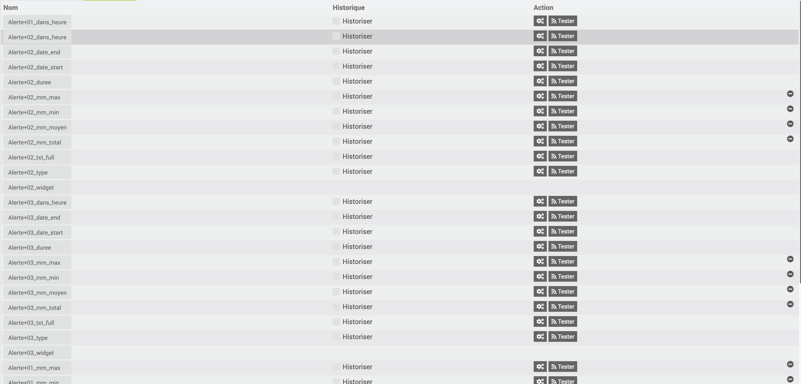
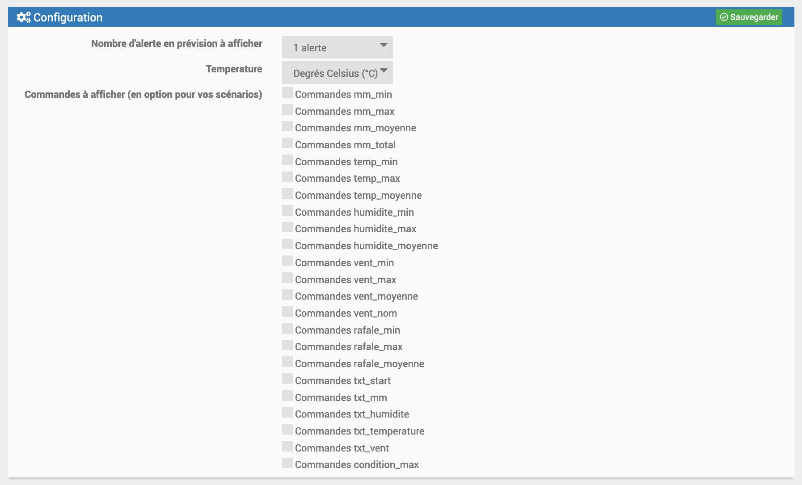
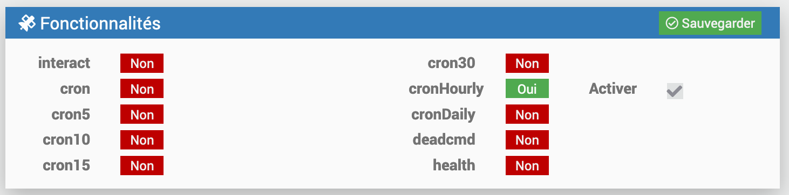
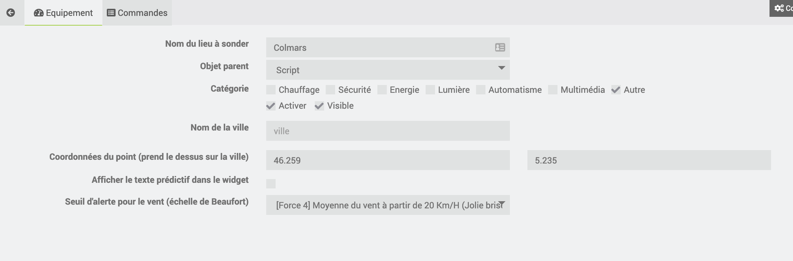
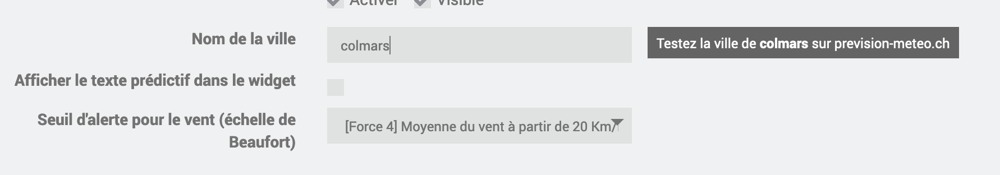
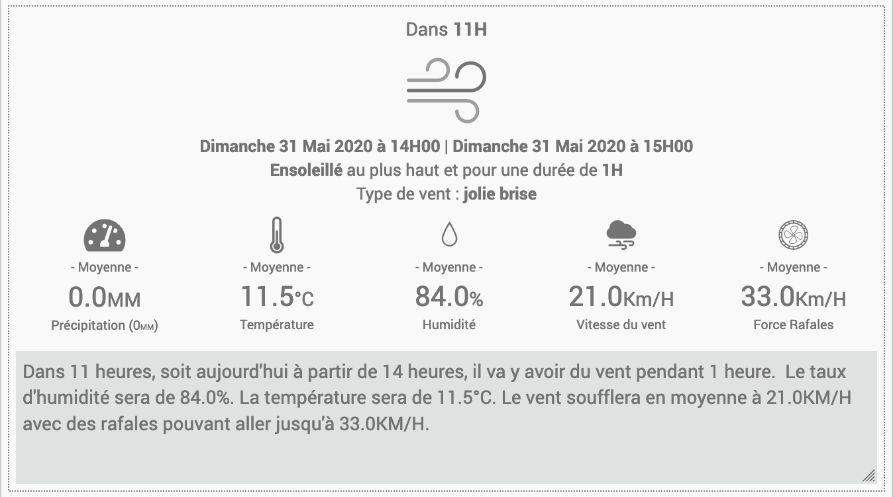
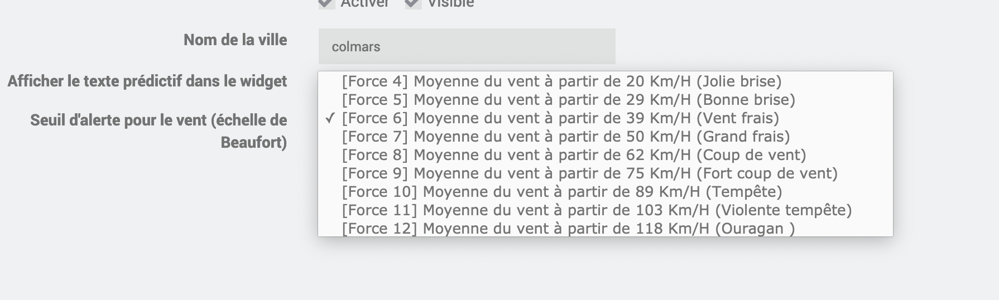
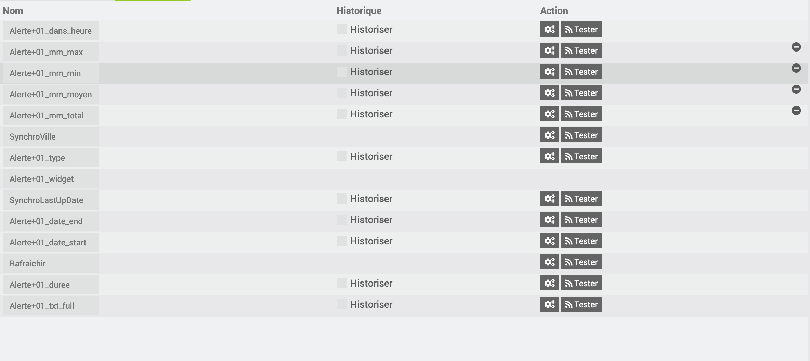

Description
===

Ce plugin annonce les prochaines alertes (72H) météo en France, Belgique et Suisse. Previsy construit également des phrases qui peuvent être utilisées pour vous être envoyées par sms, annoncées par votre home ou slack etc...

## Exemples d'utilisation

### Alertes de la vie courante

> Vous souhaitez savoir ou étendre le linge ? Prévisy vous annoncera que la prochaine pluie est dans 14H et il y aura un peu de vent cela vaut le coup de l'étendre dehors.

> Vous venez d'ouvrir un vélux ? Prévisy vous annoncera les prochaines précipitation pour penser à la fermer ou vous aider à paramétrer automatiquement une alerte une heure avant la pluie.

### Indicateurs pour les sportifs

> Après-demain dans 31H, Previsy vous annonce une bonne brise. Idéal pour sortie la planche à voile !

> Passionné de surf, vous attendez la prochaine poudreuse ? Previsy vous annonce que la neige s'arrête de tomber ce week-end, ça tombe plutôt bien !

Comme vous pouvez le voir, les prévisions peuvent vous aider sur pas mal de points.

## Deux manières d'utiliser Previsy

### Avec le widget et les phrases préconstruites.

### En utilisant directement les données brutes

Vous pourrez, bien évidemment, récupérer les données brutes pour créer vos scénarios et ainsi les associer à des services (SMS, Slack, Notification, etc.)

Installation
===

## Le plugin utilise prevision-meteo.ch

Prevision-meteo.ch est très régulièrement saturé. Pour pallier à ce problème, Previsy enregistre les données de l'API en cache et s'en sert pour réactualiser les widgets si l'API est indisponible ou trop longue à répondre.

## Configuration

### Nombre d'alerte en prévision à afficher

Cela permet de configurer le nombre d'alertes que vous souhaitez afficher. 

**Exemple**
> "Vous souhaitez afficher uniquement les 2 prochaines alertes."*

### Température
Vous avez la possibilité d'afficher les températures en degrés Celsius (°C) ou en degrés Fahrenheit (°F)

### Commandes à afficher (en option pour vos scénarios)
Les données vous permettant de créer vos scénarios sur mesure. Il vous suffit de cocher les commandes que vous souhaitez voir apparaitre. Vous n'aurez probablement pas besoin de tout utiliser. (toutes les commandes seront décrites par la suite). 

**Attention**
> Si vous voulez afficher 5 alertes et toutes les commandes vous allez en avoir beaucoup ! 

### Tâche planifiée
Si vous désactivez la tâche planifiée qui à lieu toutes les heures ... le plugin ne servira plus à rien ...

Gestion
===

## Equipement

### Ville
Ici on entre le mot-clé correspondant à la ville que vous désirez sonder. Pour vous permettre de tester, un bouton va s'afficher à droite de la saisie pour tester directement sur le site de prevision-meteo.ch
Si le site est offline ou met du temps à répondre il faudra retenter plus tard.

> Dans l'url le mot-clé de la ville : https://www.prevision-meteo.ch/meteo/localite/votreville

### Coordonnées du point

Renseignez la latitude et la longitude de l'endroit que vous désirez sonder. Si vous renseignez des coordonnées la ville ne sera pas prise en compte.

> Dans l'url les coordonnées : https://www.prevision-meteo.ch/meteo/localite/lat=01.500lng=65.100

### Afficher le texte prédictif dans le widget 

Cela permet d'afficher le texte prédictif dans le widget.
Les alertes météos (pluie, neige, etc..) sont prioritaires sur celle du vent.

### Seuil d'alerte pour le vent

Vous pouvez régler le seuil du vent suivant la localité. L'alerte "vent" ne se déclenchera pas en dessous de ce seuil.

## Commandes

> Le nombre de commandes sera forcément proportionnel au nombre d'alerte que vous avez configurée.

### Les commandes générales

| Type | Commande | Description |
| ------------ | ------------ | ------------ | 
| info | SynchroVille | Cela correspond à la ville que vous avez enregistrée. |
| info | SynchroLastUpDate | Date au format "timestamp" de la dernière synchronisation avec le site prevision-meteo.ch. | 
| info | Latitude | Comme son nom l'indique | 
| info | Longitude | Comme son nom l'indique | 
| info | Type_degre | °C ou °F | 
| action | Rafraichir | La fameuse commande permettant de rafraîchir le widget. Cela lancera une synchro au prêt de prevision-meteo.ch. | 

### Les commandes liées aux alertes

> Les commandes qui suivent sont liées à l'alerte 1 identifié par le "01". Plus il y a d'alerte plus il y aura de commande.

| Type | Commande | Description |
| ------------ | ------------ | ------------ |
| info | Alerte+01_txt_full | C'est la phrase complète. Elle comporte toutes les indications liées à la météo. Exemple : "Dans 18 heures, soit demain à partir de 16 heures, il va pleuvoir durant 1 heure. Il y aura un total de 0.3 millimètre de précipitation. Le taux d'humidité sera de 99.0%. La température sera de 10.5°C. Le vent soufflera en moyenne à 24.0 KM/H avec des rafales pouvant aller jusqu'à 38.0 KM/H." |  
| info | Alerte+01_txt_start | C'est la première partie de la phrase. Exemple : "Dans 18 heures, soit demain à partir de 16 heures, il va pleuvoir durant 1 heure." | 
| info | Alerte+01_txt_mm | C'est la partie de la phrase liée à la précipitation. Exemple : "Il y aura un total de 0.3 millimètre de précipitation." | 
| info | Alerte+01_txt_humidite  | C'est la partie de la phrase liée à l'humidité. Exemple : "Le taux d'humidité sera de 99.0%." | 
| info | Alerte+01_txt_temperature | C'est la partie de la phrase liée à la température. Exemple : "La température sera de 10.5°C." | 
| info | Alerte+01_txt_vent | C'est la partie de la phrase liée au vent. Exemple : "Le vent soufflera en moyenne à 24.0 KM/H avec des rafales pouvant aller jusqu'à 38.0 KM/H." | 

> Vous l'aurez compris, cela vous permettra de reconstruire vos phrases comme vous le souhaitez !

| Type | Commande | Description |
| ------------ | ------------ | ------------ | 
| info | Alerte+01_dans_heure | Prochaine alerte en heure. |
| info | Alerte+01_date_start | Date de début de la prochaine alerte au format YmdHi. | 
| info | Alerte+01_date_end | Date de fin de la prochaine alerte au format YmdHi. | 
| info | Alerte+01_type | Type d'alerte (pluie, neige, neige_pluie, orage, brouillard ou vent). | 
| info | Alerte+01_condition_max | Description de l'alerte au plus haut. | 
| info | Alerte+01_duree | Durée de l'alerte (du même type et successif). | 
| info | Alerte+01_mm_min | Précipitation Minimum. |
| info | Alerte+01_mm_max | Précipitation Maximum. | 
| info | Alerte+01_mm_moyenne | Moyenne des Précipitations. | 
| info | Alerte+01_mm_total | Total des Précipitations. | 
| info | Alerte+01_temp_min | Température Minimum. | 
| info | Alerte+01_temp_max | Température Maximum. | 
| info | Alerte+01_temp_moyenne | Moyenne des Températures. | 
| info | Alerte+01_humidite_min | Taux d'Humidité Minimum. | 
| info | Alerte+01_humidite_max | Taux d'Humidité Maximum. | 
| info | Alerte+01_humidite_moyenne | Moyenne du Taux d'Humidité. | 
| info | Alerte+01_vent_min | Vitesse Minimum du Vent. | 
| info | Alerte+01_vent_max | Vitesse Maximum du Vent. | 
| info | Alerte+01_vent_moyenne | Moyenne de la Vitesse du Vent. | 
| info | Alerte+01_rafale_min | Vitesse Minimum des rafales. | 
| info | Alerte+01_rafale_max | Vitesse Maximum des rafales. | 
| info | Alerte+01_rafale_moyenne | Moyenne de la Vitesse des rafales. | 
